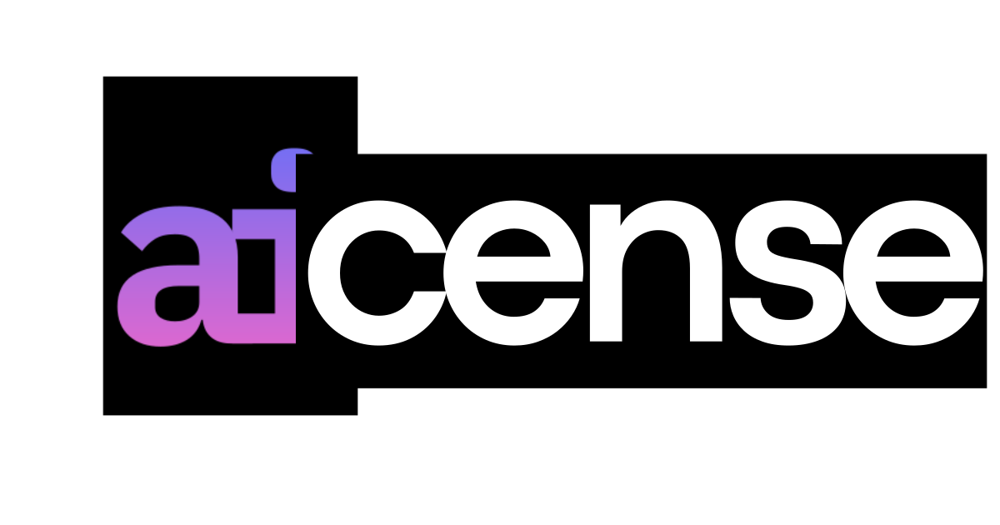

<p align="center">
  
</p>

<p align="center">
  
  
  
  
</p>

<h1 align="center">Find the right open-source license in under a minute</h1>

<p align="center">
  An AI-powered, interactive consultant that helps developers choose the perfect OSI-approved open-source license for their projects by asking simple, jargon-free questions.
</p>

---

## 📖 About LAICENSE

Choosing an open-source license can be intimidating. Developers often get bogged down in legal jargon like "copyleft," "patent retaliation," and "network SaaS restrictions." 

**LAICENSE** simplifies this process. Instead of expecting you to understand legal terminology, it acts like a human consultant. It asks 3 to 5 straightforward, scenario-based questions (e.g., *"If someone changes your code, must they share their new version publicly?"*) and intelligently narrows down a definitive list of 13 standard open-source licenses to find the exact right fit for your project.

## ✨ Features

- **Jargon-Free:** Zero legal terminology during the questionnaire. Everything is translated into plain English.
- **Lightning Fast:** Get a definitive recommendation in less than 60 seconds (3-5 turns max).
- **Comprehensive Results:** Provides the recommended license, a short summary, what it allows (Pros), its limitations (Cons), official reading links, and similar alternatives from different license categories to show tradeoffs.
- **Fail-Safe UI:** Includes robust error handling to prevent infinite loading if the AI model drops connection.


---

## 🧠 The AI Logic & Implementation

Unlike typical AI wrappers that might hallucinate non-existent licenses or give varying legal advice, LAICENSE uses a **Strict Deterministic AI Architecture**. The AI does not invent answers; it acts as a smart filter for a hardcoded database.

### 1. The Authoritative Database
The application relies on a hardcoded, server-side array of 13 meticulously categorized OSI-approved licenses:
- **Public Domain:** The Unlicense, CC0 1.0
- **Permissive:** MIT, Apache 2.0, BSD 2-Clause, BSD 3-Clause, Boost 1.0
- **Weak Copyleft:** MPL 2.0, EPL 2.0, LGPL v2.1
- **Strong Copyleft:** GPL v2.0, GPL v3.0, AGPL v3.0

The AI is strictly instructed to *only* recommend licenses from this injected database.

### 2. The "Akinator" Strategy
The system prompt instructs the AI (powered by `gemini-2.5-flash`) to play a binary search game. On every turn, the AI looks at the remaining candidate licenses and calculates which trait splits the pool as evenly in half as possible. 

### 3. Server-Side State Injection
To prevent context window degradation and role-alternation crashes, the app derives the `turnNumber` and a `maybeStreakCount` on the server before calling the LLM.
- If the user answers "Maybe" twice in a row, the AI uses the streak count to treat the answer as a "No", forcing elimination and preventing infinite loops.
- The AI is hard-capped to make a final recommendation by Turn 5.

### 4. Strict JSON Output Schema
To seamlessly integrate with the React frontend, the model is configured with `responseMimeType: "application/json"`. It conditionally returns one of two strict schemas:
- **Schema A (Question):** The next plain-English question and options ["Yes", "No", "Maybe"].
- **Schema B (Recommendation):** The final output containing the recommended license, pros, cons, and similar alternatives.


## 🚀 Getting Started

To run LAICENSE locally on your machine:

1. **Clone the repository:**
   ```bash
   git clone 
   https://github.com/Georgebruh/Laicense.io.git
   cd laicense.io
   ```
2. **Install dependencies:**
   ```bash
   npm install
   ```
3. **Set up environment variables:**
   Create a `.env.local` file in the root and add your Gemini key:
   ```bash
   GEMINI_API_KEY=your_api_key_here
   ```
4. **Start the development server:**
   ```bash
   npm run dev
   ```
5. **Open in browser:**
   Navigate to `http://localhost:3000`.

## ⚖️ Legal Disclaimer

LAICENSE provides informational guidance based on standard open-source practices. This application and its AI-generated recommendations do not constitute official legal advice. Always consult a qualified attorney for legal decisions regarding intellectual property and software licensing.

## 🤝 Contributing

Contributions are what make the open-source community such an amazing place to learn, inspire, and create. Any contributions you make to LAICENSE are greatly appreciated.

- Fork the Project
- Create your Feature Branch (`git checkout -b feature/AmazingFeature`)
- Commit your Changes (`git commit -m 'Add some AmazingFeature'`)
- Push to the Branch (`git push origin feature/AmazingFeature`)
- Open a Pull Request

## 📝 License

Distributed under the MIT License. See `LICENSE.txt` for more information.

(Irony noted: an app that helps you choose a license, using the MIT license itself!)